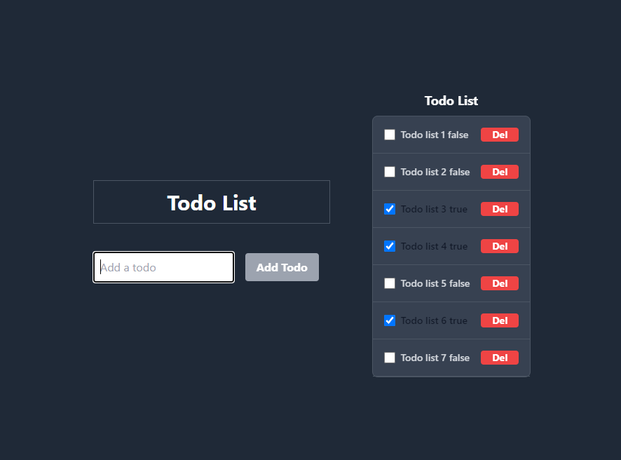

### TodoList API And SPA




#### How to run

```bash
git clone git@github.com:falconsw/todolist-api-spa.git
cd todolist-api-spa
```

Symfony Installation:
```bash
cd todolist_api
```

```bash
composer install
```
server running:
```bash
symfony server:start
```

#### API URL

```bash
http://127.0.0.1:8000/api/doc
```

#### SPA URL

```bash
http://127.0.0.1:3000
```
React.js Installation:
```bash
cd todolist_spa
```

```bash
npm install && npm run start
```


[](https://sonarcloud.io/dashboard?id=falconsw_todolist-api-spa)
######  This Test Only for PHP API
